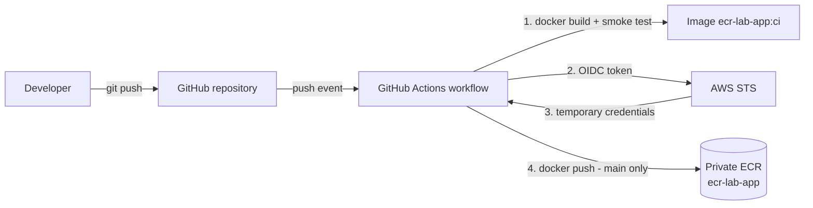

# Push Docker Image to ECR — Lab

Java HTTP application containerized with Docker and pushed to a **private Amazon ECR
repository** by GitHub Actions, authenticating to AWS with **GitHub OIDC** — no
long-lived AWS credentials anywhere.

## Architecture



1. Every push (any branch) builds the image and smoke-tests `/health`.
2. On `main` only, the workflow exchanges a GitHub OIDC token for temporary AWS
   credentials via `aws-actions/configure-aws-credentials`.
3. The image is tagged and pushed to the private ECR repository.

## Repository layout

| Path | Purpose |
|------|---------|
| `app/` | Java 21 application (dependency-free `com.sun.net.httpserver`) + Dockerfile + `.dockerignore` |
| `.github/workflows/push-to-ecr.yml` | CI/CD pipeline |
| `infra/ecr.yml` | CloudFormation template defining the ECR repository (scan-on-push, encryption, lifecycle policy, tags) |

## Image tagging

Required format `yourfullname_appname`:

- `gideondakore_ecr-lab-app` — stable tag, updated on every `main` build
- `gideondakore_ecr-lab-app-<short-sha>` — immutable per-commit tag for traceability

## Security design

### No AWS secrets in GitHub

The only value stored in GitHub is the **IAM role ARN** (`AWS_ROLE_ARN` secret) and
the region (`AWS_REGION` variable). A role ARN is an identifier, not a credential —
it is useless without passing the role's trust policy. Authentication happens
exclusively through OIDC-issued, short-lived STS credentials.

### IAM role trust policy (GitHub OIDC)

The role trusts GitHub's OIDC provider and is restricted to this repository's
`ecr-lab` GitHub environment. The environment's deployment-branch policy is set
to `main` only, so no other branch can assume the role:

```json
{
  "Version": "2012-10-17",
  "Statement": [
    {
      "Effect": "Allow",
      "Principal": {
        "Federated": "arn:aws:iam::288761749193:oidc-provider/token.actions.githubusercontent.com"
      },
      "Action": "sts:AssumeRoleWithWebIdentity",
      "Condition": {
        "StringEquals": {
          "token.actions.githubusercontent.com:aud": "sts.amazonaws.com",
          "token.actions.githubusercontent.com:sub": "repo:gideondakore/ecr-lab:environment:ecr-lab"
        }
      }
    }
  ]
}
```

### IAM role permissions (least privilege)

Only the actions required to push to **this one repository**; the only
account-wide action is `ecr:GetAuthorizationToken`, which cannot be
resource-scoped:

```json
{
  "Version": "2012-10-17",
  "Statement": [
    {
      "Sid": "ECRAuth",
      "Effect": "Allow",
      "Action": "ecr:GetAuthorizationToken",
      "Resource": "*"
    },
    {
      "Sid": "ECRPush",
      "Effect": "Allow",
      "Action": [
        "ecr:BatchCheckLayerAvailability",
        "ecr:InitiateLayerUpload",
        "ecr:UploadLayerPart",
        "ecr:CompleteLayerUpload",
        "ecr:PutImage",
        "ecr:BatchGetImage"
      ],
      "Resource": "arn:aws:ecr:eu-west-1:288761749193:repository/ecr-lab-app"
    }
  ]
}
```

### Container security

- Multi-stage build — Maven toolchain never ships in the runtime image
- Minimal base: `eclipse-temurin:21-jre-alpine`
- Runs as an unprivileged `app` user (no root)
- `.dockerignore` keeps build context minimal
- `HEALTHCHECK` on `/health`

### Pipeline fail-safety

- `set -euo pipefail` in every shell step — any error aborts the job
- Smoke test: the image must serve `/health` **before** anything is pushed
- Push steps are gated to `main`; feature branches build and test only
- `concurrency` group prevents overlapping pushes per ref

## Provisioning the ECR repository (IaC)

```bash
aws cloudformation deploy \
  --stack-name ecr-lab-repository \
  --template-file infra/ecr.yml \
  --region eu-west-1
```

The template enables scan-on-push, AES-256 encryption, resource tags, and a
lifecycle policy (expire untagged images after 7 days, keep the 20 most recent
per-commit images). Optionally connect the repo with **CloudFormation Git sync**
to have stack updates applied automatically on push.

## Running locally

```bash
docker build -t ecr-lab-app ./app
docker run -d --name ecr-lab -p 8080:8080 ecr-lab-app
curl http://localhost:8080/health   # {"status":"ok"}
```

## Deliverables

- **GitHub repository:** `https://github.com/gideondakore/ecr-lab`
- **Private ECR repository:** `https://eu-west-1.console.aws.amazon.com/ecr/repositories/private/288761749193/ecr-lab-app`
